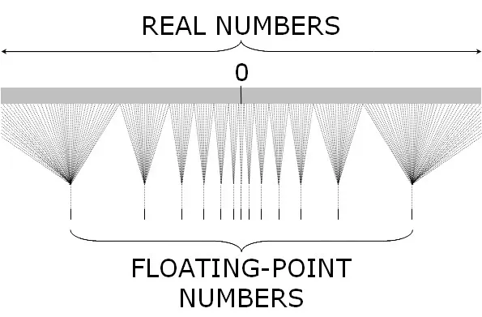

## Breve historia de los sistemas de numeración

| Época | Sistema | Características |
|---|---|---|
| ~30 000 a.C. | Sistemas de conteo primitivos (unarios) | Hueso de Lebombo y hueso de Ishango — muescas talladas en hueso |
| ~2500 a.C. | Babilonios | Base 60, **posicional** (avance decisivo) |
| ~500 a.C. | Griegos | Numeración con letras |
| 500 a.C. – s. XIV | Romanos | Aditivo: `CXCIV = 194`, `XLVIII = 48` |
| ~s. VIII | Chinos | Multiplicativo, basado en potencias de 10: 一 二 三 四 五 六 七 八 九 十 |
| 36 a.e.c. – ~350 a.e.c. | Mayas | Base 20, con un símbolo para el cero |
| 628 d.C. → ~800 → s. XIII | Indo-arábigo | India (Brahmagupta) → Arabia (Al-Juarismi / Al-Khwarizmi) → Europa (Fibonacci) |
| S. XVII | Pascal | Otras bases |
| S. XVII | Leibniz | Base 2 |
| S. XIX (finales) | Peano y Dedekind | Fundamentación formal |

**Ejemplo unario:** `II + III = IIIII`

## El sistema posicional decimal

$$243 = 2\cdot100+4\cdot10+3 = 2\cdot10^2+4\cdot10^1+3\cdot10^0$$

Fracciones simples:

$$\frac{3}{2}=\frac{6}{4} \qquad 1{,}5 = 1+\frac{5}{10}=1\frac{5}{10}=1\frac12$$

$$\frac{7}{6}=1{,}1\overline{6}=1\cdot10^0+1\cdot10^{-1}+6\cdot10^{-2}+\cdots$$

**Forma general de un número posicional**, con dígitos $a_i \in \{0,1,\ldots,9\}$:

$$a_n a_{n-1}\cdots a_0,\, a_{-1}\, a_{-2}\, a_{-3}\cdots$$

$$= a_n\cdot10^n + a_{n-1}\cdot10^{n-1}+\cdots+a_0\cdot10^0+a_{-1}\cdot10^{-1}+a_{-2}\cdot10^{-2}+\cdots$$

$$=\underbrace{\sum_{k=0}^{n} a_k\,10^k}_{\text{parte entera}} + \underbrace{\sum_{k=1}^{\infty} a_{-k}\,10^{-k}}_{\text{parte decimal o mantisa}}$$

## Otras bases

::: {.callout-note title="Ejercicio"}
Convertir $\left(\dfrac13\right)_{10}$ a base 3.
:::

$$\left(\frac13\right)_{(10)} = (0{,}1)_{(3)}$$

la expansión termina exactamente, porque $3^{-1}=1/3$.

Para contraste, $(1/10)_{10}$ en base 3 **no** termina:

$$\left(\frac{1}{10}\right)_{(10)} = (0{,}0\overline{2})_{(3)}$$

**Alfabetos según la base:**

- Binario: $\{0,1\}$ → un dígito es un **bit**
- Octal: $\{0,1,\ldots,7\}$ → un dígito octal (byte) representa **3 bits**
- Hexadecimal: $\{0,1,\ldots,9,A,B,C,D,E,F\}$ → un dígito hexadecimal (**nibble**) representa **4 bits**

**Correspondencia binario ↔ octal (3 bits):**

| Binario | Octal |
|:---:|:---:|
| 000 | 0 |
| 001 | 1 |
| 010 | 2 |
| 011 | 3 |
| 100 | 4 |
| 101 | 5 |
| 110 | 6 |
| 111 | 7 |

::: {.callout-tip title="Ejemplo — multiplicación en hexadecimal"}
$$12_{16} \times F_{16} = 10E_{16}$$

Verificación pasando a decimal:

$$12_{16}=1\cdot16+2=18 \qquad F_{16}=15 \qquad 18\times15=270$$

$$270 = 1\cdot16^2+0\cdot16+14 \;\Longrightarrow\; 10E_{16}\ \checkmark$$
:::

## El conjunto 𝔽 de números de punto flotante {#sec-def-F}

$$\mathbb{F} = \{\,0,\ \pm(1+f)\,2^{\,n}\,\}$$

- $n\to$ **exponente**
- $1+f \to$ **significando** (mantisa)
- $\displaystyle f=\sum_{i=1}^{d} b_i\,2^{-i}, \quad b_i\in\{0,1\}$
- $d$ se llama la **precisión binaria**

### Ejemplos de normalización

$$4=(1+0)\cdot2^2 \qquad\qquad 4=(1+f)\cdot2^1 \;\Rightarrow\; 1+f=2 \Rightarrow f=1\ \text{✗ (fuera de }[0,1))$$

$$5=(1+x)\cdot2^1 \Rightarrow 1+x=\tfrac52=2{,}5 \Rightarrow x=\tfrac32\ \text{✗ (fuera de }[0,1))$$

$$5=(1+f)\cdot2^2 \Rightarrow 1+f=\frac54 \Rightarrow f=\frac14=0{,}25=0{,}01_2\ \checkmark$$

::: {.callout-important title="Por qué falla el primer intento"}
La normalización exige $1+f\in[1,2)$; por eso el exponente correcto para 5 es $n=2$, no $n=1$.
:::

$$\frac13=(1+f)\cdot2^{-1}\Rightarrow 1+f=\frac23\Rightarrow f=-\frac13\ \text{✗ (}f<0\text{)}$$

$$\frac13=(1+f)\cdot2^{-2}\Rightarrow 1+f=\frac43\Rightarrow f=\frac13\ \checkmark$$

En decimal, $f=0{,}\overline{3}=\dfrac{3}{10}+\dfrac{3}{10^2}+\cdots$. 
**En binario**, usando la serie geométrica:

$$\frac13=\frac{1/4}{1-1/4}=\frac14\sum_{k=0}^{\infty}\left(\frac14\right)^k=\sum_{k=1}^{\infty}\frac{1}{4^{k}}=\sum_{k=1}^{\infty}\frac{1}{2^{2k}}=0{,}010101\ldots_2$$

Por tanto se puede aproximar por un número de $\mathbb {F}$ pero $\tfrac13\notin \mathbb{F}$ para ningunos $d$ y $n$.  

## Cuántos elementos de 𝔽 hay por binade

$$f=\sum_{i=1}^{d}b_i\,2^{-i}=2^{-d}\sum_{i=1}^{d}b_i\,2^{\,d-i}=2^{-d}z$$

$$1+f\in[1,2)\quad\text{para } z\in\{0,1,2,\ldots,2^d-1\}$$

::: {.callout-important title="Resultado clave"}
Entre $2^n$ y $2^{n+1}$ hay $2^d$ números que pertenecen a $\mathbb{F}$.
:::

> Referencia de las notas: `float32/float` → $d=23$; `float64/double` → $d=52$ (IEEE 754).

### Caso $d=0$

Solo hay un valor de $f$ ($f=0$), así que cada binade aporta un único punto:

$$n=0:\ \pm(1+0)2^0=\pm1 \qquad n=1:\ \pm2 \qquad n=2:\ \pm4 \qquad n=3:\ \pm8$$

**Con $d=0$, los únicos números posibles son $\pm2^n$.**

### Caso $d=1$

Con $b_1\in\{0,1\}$: $1+f\in\{1,\ 3/2\}$. Tomando el valor $3/2$ como ejemplo representativo en cada exponente:

$$n=0:\ \pm\left(1+\tfrac12\right)2^0=\pm\tfrac32 \qquad\qquad n=1:\ \pm\tfrac32\cdot2=\pm3$$

$$n=-1:\ \pm\tfrac32\cdot\tfrac12=\pm\tfrac34 \qquad\qquad n=2:\ \pm\tfrac32\cdot4=\pm6 \qquad\qquad n=-2:\ \pm\tfrac32\cdot\tfrac14=\pm\tfrac38$$

### Simulación de $\mathbb{F}$ en Julia

 **Recta numérica** (colores por exponente, simulación):

<iframe src="notebooks/flotantes.html" width="100%" height="650px" style="border:none;"></iframe>

[Ver código fuente de la simulación de $\mathbb{F}$](notebooks/flotantes-codigo.html)

[Descargar el código  fuente  la simulación de $\mathbb{F}$](notebooks/flotantes_F.jl)

::: {.callout-tip title="Ejemplo motivador de lo que viene"}
$$0{,}1+0{,}2\neq0{,}3$$
:::

## Espaciado dentro de un binade

Retomando $f=2^{-d}z$ con $z\in\{0,\ldots,2^d-1\}$, si $x_k=(1+2^{-d}k)\,2^n$:

$$x_{k+1}-x_k=\big(1+2^{-d}(k+1)\big)2^n-\big(1+2^{-d}k\big)2^n=2^n\,2^{-d}=2^{n-d}$$

**— el mismo espacio; hay $2^d$ números.**

El binade **empieza** en $f=0$ (es decir, en $2^n$) y **termina** en $f_{\max}=\sum_{i=1}^{d}2^{-i}$:

$$(1+f)2^n=\big(1+(2^d-1)2^{-d}\big)2^n=\big(1+1-2^{-d}\big)2^n=2^{\,n+1}-2^{\,n-d}$$

## Machine epsilon

El número que le sigue a 1 es $1+2^{-d}$, entonces el **épsilon de máquina** es

$$\varepsilon_{\text{mach}}=2^{-d}$$

::: {.callout-note}
En Julia, `eps()` para `Float64` da $2^{-52}$.
:::

**Definimos** $\text{fl}(x)=\operatorname*{argmin}_{y\in\mathbb{F}}|x-y|$.

La distancia en cada binade $[2^n,2^{n+1})$ es $2^{n-d}=2^n\varepsilon_{\text{mach}}$.

Cada número real $x$ está a una distancia a lo más

$$2^{\,n-d-1}=\frac{2^{n}\varepsilon_{\text{mach}}}{2}\qquad\text{de }\mathbb{F}, \qquad\text{es decir,}\qquad |\text{fl}(x)-x|\le2^{\,n-d-1}$$

## De error absoluto a error relativo

Al dividir por $|x|\ge2^n$:

$$\frac{|\text{fl}(x)-x|}{|x|}\le\frac12\,\varepsilon_{\text{mach}}$$

$$|\text{fl}(x)-x|\le\frac12\,\varepsilon_{\text{mach}}\,|x|$$

$$\text{fl}(x)=x+\frac12\,\varepsilon_{\text{mach}}\,|x|=x\left(1+\frac12\,\varepsilon_{\text{mach}}\,\operatorname{sgn}(x)\right)=x(1+\epsilon)\quad\text{con }|\epsilon|\le\tfrac12\varepsilon_{\text{mach}}$$

::: {.callout-important title="Pregunta abierta de las notas"}
¿Qué quiere decir que el error absoluto puede ser grande y el relativo no?
:::

## Precisión y exactitud

Si expresamos

$$\pm(1+f)\,2^n = \pm\left(1+\sum_{i=1}^{d} b_i\,2^{-i}\right)2^n$$

en base 10, se convierte en

$$\pm(b_0+f_{10})\,10^n = \pm\left(b_0+\sum_{i=1}^{d} b_i\,10^{-i}\right)10^n$$

donde cada $b_i\in\{0,\ldots,9\}$ y $b_0\neq0$. Esto no es otra cosa que la **notación científica**, con $d+1$ cifras significativas.

::: {.callout-note title="Ejemplo — constante de Planck"}
$$h = 6.626068\times10^{-34}\ \mathrm{m^2\,kg/s}$$

Supongamos que ajustamos el último dígito de 8 a 9. Entonces el cambio relativo es

$$\frac{|\text{valor inicial}-\text{valor final}|}{|\text{valor inicial}|}=\frac{0{,}000001\times10^{-34}}{6{,}626068\times10^{-34}}\approx1{,}51\times10^{-7}$$

Decimos entonces que la constante está dada con **7 dígitos de precisión**.
:::

**La precisión** de un número flotante son los $d$ dígitos binarios. **La exactitud** es qué tan lejos está la aproximación del resultado.

Si $\tilde{x}$ es la aproximación de $x$:

- **Exactitud absoluta:** $|\tilde{x}-x|$ — mismas unidades que $x$.
- **Exactitud relativa:** $\dfrac{|\tilde{x}-x|}{|x|}$ — adimensional.

Por ejemplo, si la exactitud de la aproximación anterior es $1{,}51\times10^{-7}=0{,}0000001\underbrace{51}_{\text{7 cifras signif.}}$, el entero más cercano a

$$-\log_{10}\left|\frac{\tilde{x}-x}{x}\right|$$

da la **"cantidad de dígitos de exactitud"**, sin necesidad de aproximarlo al entero:

$$-\log_{10}(1{,}51\times10^{-7}) = -\log_{10}(1{,}51)+7 \approx 6{,}82$$

*(el logaritmo cuenta esa cadena inicial de ceros).* Ejemplo clásico: $\rho=22/7$ frente a $\pi$.

### El estándar IEEE 754

| Tipo | $d$ (bits de significando) | $n$ (bits de exponente) |
|---|---|---|
| `Float32` (precisión sencilla) | 23 | 8 |
| `Float64` (precisión doble) | 52 | 11 |

Con las funciones `sign`, `exponent` y `significand` podemos extraer las partes de un $x\in\mathbb{F}$.

## Aritmética de máquina

La aritmética se calcula de tal manera que si $x,y\in\mathbb{F}$, entonces $x\oplus y\in\mathbb{F}$ de tal manera que

$$\frac{|(x\oplus y)-(x+y)|}{|x+y|}\le\frac12\,\varepsilon_{\text{mach}}$$

::: {.callout-tip title="Ejemplos"}
$$(1{,}0+\texttt{eps()}/2)-1 = 0$$

$$1{,}0+(\texttt{eps()}/2-1) \neq 0$$

$$0{,}1+0{,}2\neq0{,}3$$
:::

Estos ejemplos muestran que la **ley asociativa de la suma se rompe** en aritmética de punto flotante: el orden en que se agrupan las operaciones puede cambiar el resultado.

## Tarea

Resolver **todos los ejercicios de la sección 1.1.4** ("Exercises") de *Fundamentals of Numerical Computation*, disponibles en <https://fncbook.com/julia/floating-point/#exercises>: los ejercicios 1.1.1 a 1.1.5, sobre el conjunto $\mathbb{F}$, la equivalencia de las cotas de error, aproximaciones racionales a $\pi$, precisión sencilla IEEE 754, y `nextfloat`.