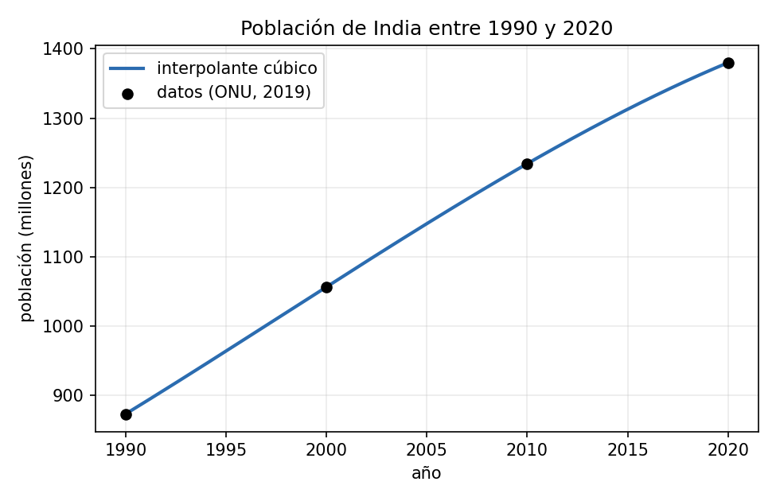

Antes de hacer los ejercicios de las secciones 2.1--2.3 familiarícese con la manipulación matricial y los comandos básicos de Polynomials y Plots en Julia.

## Problema de demografía (ejercicio 2.1.3)

Los datos son poblaciones (en millones) de tres países en cuatro censos:

| | 1990 | 2000 | 2010 | 2020 |
|---|---|---|---|---|
| Estados Unidos | 252,120 | 281,711 | 309,011 | 331,003 |
| India | 873,278 | 1.056,576 | 1.234,281 | 1.380,004 |
| Polonia | 37,960 | 38,557 | 38,330 | 37,847 |

Con cuatro puntos por país buscamos, en cada caso, el único polinomio cúbico que pasa por ellos. Como ya vimos con los datos de población de China en la sección 2.1, conviene no trabajar directamente con los años (1990, 2000, ...) como variable independiente, porque las potencias de números tan grandes producen una matriz de Vandermonde con columnas de magnitudes muy dispares y mal condicionada. En su lugar usamos

$$t = \frac{\text{año}-1990}{10}, \qquad t=0,1,2,3$$

con lo que la matriz de Vandermonde queda con entradas entre $0$ y $27$, mucho más manejable.

```julia
year = [1990, 2000, 2010, 2020]
t = (year .- 1990) ./ 10
V = [ t[i]^j for i in 1:4, j in 0:3 ]
```

**(a) Estados Unidos en 2005.** Resolviendo $Vc = y$ con los datos de Estados Unidos se obtiene el polinomio, en la variable $t$,

$$p(t) = 252{,}120 + 29{,}730833\,t + 0{,}363\,t^2 - 0{,}502833\,t^3$$

El año 2005 corresponde a $t=1{,}5$. Evaluando,

$$p(1{,}5) \approx 295{,}836 \text{ millones}$$

```julia
c = V \ usa
p = Polynomial(c)
p(1.5)   # 295.83593750000006
```

**(b) El pico de Polonia.** Con los mismos nodos y los datos de Polonia se obtiene

$$q(t) = 37{,}960 + 1{,}198333\,t - 0{,}696\,t^2 + 0{,}094667\,t^3$$

Un máximo de $q$ en el intervalo cumple $q'(t)=0$. Derivando,

$$q'(t) = 1{,}198333 - 1{,}392\,t + 0{,}284\,t^2$$

y resolviendo la cuadrática salen dos raíces, $t\approx1{,}114$ y $t\approx3{,}787$. Solo la primera cae dentro de la ventana de datos ($0\le t\le3$, entre 1990 y 2020); la segunda corresponde a un año fuera de esa ventana (2028) y es un artefacto de extrapolar el comportamiento algebraico del polinomio más allá de donde hay datos, no algo en lo que debamos confiar (el mismo tipo de advertencia que discutimos sobre no usar un interpolante para predecir fuera del rango observado).

Revisando el signo de $q''$ en cada raíz se confirma que $t\approx1{,}114$ es efectivamente un máximo y la otra raíz es un mínimo. Entonces el pico ocurre en

$$t\approx1{,}114 \;\Longrightarrow\; \text{año}\approx2001, \qquad q(1{,}114)\approx38{,}562\text{ millones}$$

Es decir, según esta interpolación la población de Polonia alcanzó su máximo alrededor del año 2001, con algo más de 38,5 millones de habitantes, y descendió de forma sostenida en la década siguiente.

**(c) La curva de India.** El mismo procedimiento con los datos de India da un polinomio cúbico que, graficado junto con los cuatro puntos originales, se ve así:



La curva es suave y estrictamente creciente en todo el intervalo, sin ningún vaivén: con solo cuatro puntos y un cúbico no hay espacio para que aparezcan las oscilaciones que sí se ven con interpolantes de grado mucho más alto (el fenómeno de Runge, que se estudia más adelante en el capítulo 9). Aquí el interpolante se comporta como uno esperaría de una curva real de crecimiento poblacional.

## Sistemas con matrices triangulares inferiores (algoritmo 2.3.1 (forwardsub))

El problema que resuelve este algoritmo es un sistema $L\mathbf{x}=\mathbf{b}$ donde $L$ es triangular inferior, es decir, todas las entradas por encima de la diagonal son cero. La idea es que la primera ecuación del sistema involucra solamente a $x_1$:

$$L_{11}x_1 = b_1 \;\Longrightarrow\; x_1 = \frac{b_1}{L_{11}}$$

La segunda ecuación involucra a $x_1$ y $x_2$, pero $x_1$ ya lo conocemos del paso anterior, así que despejamos $x_2$:

$$L_{21}x_1 + L_{22}x_2 = b_2 \;\Longrightarrow\; x_2 = \frac{b_2 - L_{21}x_1}{L_{22}}$$

y así sucesivamente: la ecuación $i$ involucra a $x_1,\ldots,x_i$, pero los primeros $i-1$ ya se calcularon en pasos anteriores, de modo que solo queda una incógnita por despejar. En general,

$$x_i = \frac{b_i - \sum_{j=1}^{i-1} L_{ij}x_j}{L_{ii}}$$

Este proceso, de avanzar calculando un componente a la vez, es lo que le da el nombre de sustitución hacia adelante. Su implementación en Julia sigue la fórmula al pie de la letra:

```julia
function forwardsub(L, b)
    n = size(L, 1)
    x = zeros(n)
    x[1] = b[1] / L[1, 1]
    for i in 2:n
        s = sum(L[i, j] * x[j] for j in 1:i-1)
        x[i] = (b[i] - s) / L[i, i]
    end
    return x
end
```

El primer componente se calcula aparte porque la suma vacía (de $j=1$ a $0$) le daría problemas al `sum` de Julia. Dentro del ciclo, `s` acumula exactamente la parte ya conocida de la ecuación $i$, y la línea siguiente despeja $x_i$.

Vale la pena notar el costo: cada paso $i$ hace $i-1$ multiplicaciones para formar la suma, así que el total en todo el algoritmo es del orden de $n^2/2$ operaciones, muy por debajo de las $O(n^3)$ que cuesta resolver un sistema arbitrario por eliminación gaussiana completa. Esta es la razón por la que triangularizar un sistema primero (mediante la factorización LU de la siguiente sección) resulta tan valioso: una vez triangular, resolverlo es barato.

El algoritmo solo falla si algún $L_{ii}$ es cero, porque ahí aparecería una división por cero; y por el Teorema 2.3.1 del libro, eso ocurre exactamente cuando $L$ es singular.

### Caso particular (ejercicio 2.3.3)

El sistema (a) del ejercicio 2.3.2 es

$$
\begin{aligned}
-2x_1 &= -4 \\
x_1 - x_2 &= 2 \\
3x_1 + 2x_2 + x_3 &= 1
\end{aligned}
$$

que en forma matricial es $L\mathbf{x}=\mathbf{b}$ con

$$
L = \begin{bmatrix} -2 & 0 & 0 \\ 1 & -1 & 0 \\ 3 & 2 & 1 \end{bmatrix}, \qquad
\mathbf{b} = \begin{bmatrix} -4 \\ 2 \\ 1 \end{bmatrix}
$$

$L$ es triangular inferior, así que aplica directamente la sustitución hacia adelante de la sección anterior.

$$x_1 = \frac{-4}{-2} = 2$$

$$x_2 = \frac{2 - 1\cdot2}{-1} = \frac{0}{-1} = 0$$

$$x_3 = \frac{1 - 3\cdot2 - 2\cdot0}{1} = \frac{1-6-0}{1} = -5$$

$$\mathbf{x} = \begin{bmatrix} 2 \\ 0 \\ -5 \end{bmatrix}$$

El ejercicio 2.3.3 pide además verificar la solución calculando el residuo $\mathbf{b}-L\mathbf{x}$:

$$
\mathbf{b} - L\mathbf{x} =
\begin{bmatrix} -4 \\ 2 \\ 1 \end{bmatrix} -
\begin{bmatrix} -2\cdot2 \\ 1\cdot2-1\cdot0 \\ 3\cdot2+2\cdot0+1\cdot(-5) \end{bmatrix} =
\begin{bmatrix} -4-(-4) \\ 2-2 \\ 1-1 \end{bmatrix} =
\begin{bmatrix} 0\\0\\0 \end{bmatrix}
$$

El residuo es cero: como todas las entradas son enteras y las operaciones son exactas (nunca aparece una división que no dé un resultado exacto), no hay ningún error de redondeo que reportar aquí.

```julia
L = [-2 0 0; 1 -1 0; 3 2 1]
b = [-4, 2, 1]
x = forwardsub(L, b)   # [2.0, 0.0, -5.0]
b - L*x                 # [0.0, 0.0, 0.0]
```

## ¿Mal condicionamiento o inestabilidad? (ejercicio 2.3.7)

El sistema es $A\mathbf{x}=\mathbf{b}$ con

$$
A = \begin{bmatrix}
1 & -1 & 0 & \alpha-\beta & \beta \\
0 & 1 & -1 & 0 & 0 \\
0 & 0 & 1 & -1 & 0 \\
0 & 0 & 0 & 1 & -1 \\
0 & 0 & 0 & 0 & 1
\end{bmatrix}, \qquad
\mathbf{b} = \begin{bmatrix} \alpha \\ 0 \\ 0 \\ 0 \\ 1 \end{bmatrix}
$$

$A$ es triangular superior, así que se resuelve con sustitución hacia atrás (el análogo de forwardsub, pero empezando por $x_5$). Aplicando la fórmula fila por fila:

$$x_5 = 1, \quad x_4 = 1, \quad x_3 = 1, \quad x_2 = 1$$

y en la primera fila,

$$x_1 = \alpha - (-1)\cdot1 - 0\cdot1 - (\alpha-\beta)\cdot1 - \beta\cdot1 = \alpha + 1 - (\alpha-\beta) - \beta = 1$$

Con aritmética exacta, entonces, $x_1=1$ sin importar los valores de $\alpha$ y $\beta$: los términos $-\beta$ y $+\beta$ se cancelan algebraicamente y desaparecen del resultado. El problema, visto así, es completamente inofensivo.

Pero eso es cierto solo en el papel. El algoritmo de sustitución hacia atrás no ve esa cancelación de antemano: primero calcula y guarda el número $U_{14}=\alpha-\beta$ como una entrada de la matriz, y cuando $\beta$ es mucho más grande que $\alpha$, esa resta ya pierde casi todas las cifras significativas de $\alpha$ antes de que el cálculo de $x_1$ siquiera empiece. Es la misma cancelación catastrófica de la nota de condicionamiento, aquí escondida dentro de una sola entrada de la matriz en vez de en la ecuación final.

Resolviendo con $\alpha=0{,}1$ y $\beta=10,100,10^3,\ldots,10^{12}$ en aritmética de doble precisión:

| $\beta$ | $x_1$ calculado | $|x_1-1|$ |
|---|---|---|
| $10^{1}$ | $1{,}000000000000000$ | $4{,}44\times10^{-16}$ |
| $10^{2}$ | $1{,}000000000000006$ | $5{,}77\times10^{-15}$ |
| $10^{3}$ | $0{,}999999999999977$ | $2{,}28\times10^{-14}$ |
| $10^{4}$ | $0{,}999999999999636$ | $3{,}64\times10^{-13}$ |
| $10^{5}$ | $0{,}999999999994179$ | $5{,}82\times10^{-12}$ |
| $10^{6}$ | $1{,}000000000023283$ | $2{,}33\times10^{-11}$ |
| $10^{7}$ | $1{,}000000000372529$ | $3{,}73\times10^{-10}$ |
| $10^{8}$ | $1{,}000000005960465$ | $5{,}96\times10^{-9}$ |
| $10^{9}$ | $0{,}999999976158142$ | $2{,}38\times10^{-8}$ |
| $10^{10}$ | $0{,}999999618530273$ | $3{,}82\times10^{-7}$ |
| $10^{11}$ | $0{,}999993896484375$ | $6{,}10\times10^{-6}$ |
| $10^{12}$ | $1{,}000024414062500$ | $2{,}44\times10^{-5}$ |

::: {.callout-important title="Qué muestra esta tabla"}
El error crece de forma prácticamente proporcional a $\beta$: cada vez que $\beta$ se multiplica por $10$, el error también se multiplica aproximadamente por $10$. Esto es justo lo que se espera cuando la cancelación ocurre entre $\alpha-\beta$ y $\beta$: el error absoluto que introduce el redondeo al formar $\alpha-\beta$ es del orden de $\beta\cdot\epsilon_{\text{mach}}$, y ese error queda atrapado en $x_1$ sin que ninguna operación posterior lo corrija.

Es el mismo mensaje de siempre. El problema (calcular $x_1$ a partir de $A$ y $\mathbf{b}$) tiene una respuesta exacta, $x_1=1$, que no depende de $\beta$ en absoluto. Lo que falla es el orden en el que el algoritmo hace las operaciones: construir primero $\alpha-\beta$ como un número aparte es una elección de implementación, no una necesidad matemática, y es esa elección la que expone el cálculo a la cancelación.
:::

```julia
function backsub(U, b)
    n = size(U, 1)
    x = zeros(n)
    x[n] = b[n] / U[n, n]
    for i in n-1:-1:1
        s = sum(U[i, j] * x[j] for j in i+1:n)
        x[i] = (b[i] - s) / U[i, i]
    end
    return x
end

α = 0.1
for k in 1:12
    β = 10.0^k
    U = [1 -1 0 (α-β) β; 0 1 -1 0 0; 0 0 1 -1 0; 0 0 0 1 -1; 0 0 0 0 1]
    b = [α, 0, 0, 0, 1]
    x = backsub(U, b)
    println(β, "  ", x[1], "  ", abs(x[1]-1))
end
```