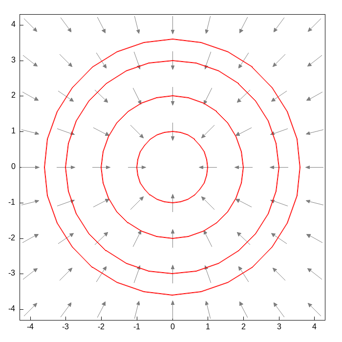

## Dos maneras nuevas de reconocer una ecuación

Hasta ahora hemos resuelto ecuaciones separables y las hemos usado para encontrar familias ortogonales. Pero la mayoría de las ecuaciones $y'=f(x,y)$ que uno escribe al azar no son separables: $f(x,y)$ simplemente no se deja factorizar como un producto $g(x)h(y)$. Esta sección presenta dos maneras distintas en que una ecuación así puede, sin embargo, resolverse por completo: porque tiene una simetría de escala escondida (ecuaciones homogéneas), o porque en realidad es la diferencial total de una función (ecuaciones exactas). En ambos casos el punto no es memorizar una fórmula, sino aprender a reconocer una estructura.

## Ecuaciones homogéneas

### De las trayectorias ortogonales a un ángulo cualquiera

En la sección de Familias Ortogonales encontramos la familia perpendicular a $y'=f(x,y)$ reemplazando la pendiente por su recíproco negativo: $y'=-1/f(x,y)$. Ese es apenas el caso particular en que el ángulo de cruce es de $90°$. ¿Qué pasa si en cambio queremos que una segunda familia cruce a la primera en un ángulo cualquiera $\alpha$, el mismo en todo punto de contacto?

Si en el punto $P=(x,y)$ la primera curva tiene pendiente $f(x,y)=\tan\varphi$, donde $\varphi$ es el ángulo que forma su tangente con el eje $x$, entonces la segunda curva, al cruzarla con ángulo $\alpha$, tiene una tangente que forma el ángulo $\varphi+\alpha$ con el eje $x$. Por la identidad de la tangente de una suma,

$$\tan(\varphi+\alpha)=\frac{\tan\varphi+\tan\alpha}{1-\tan\varphi\tan\alpha}$$

así que la segunda familia satisface esta ecuación (es el problema 10 de la sección 7 del Simmons):

$$y'=\frac{f(x,y)+\tan\alpha}{1-f(x,y)\tan\alpha}$$

::: {.callout-tip title="Consistencia con el caso ortogonal"}
Si $\alpha\to 90°$, entonces $\tan\alpha\to\infty$. Dividiendo numerador y denominador entre $\tan\alpha$ y tomando el límite, el término $f(x,y)/\tan\alpha$ se anula y queda $y'\to -1/f(x,y)$. La fórmula de trayectorias ortogonales es, entonces, apenas el caso límite $\alpha=90°$ de esta fórmula más general.
:::

### El ejercicio: cruzar los círculos concéntricos en $45°$

Apliquemos esto a la familia de círculos $x^2+y^2=c$ (problema 11, literal b, de la misma sección). Derivando implícitamente, $2x+2yy'=0$, así que la familia original satisface

$$y'=-\frac{x}{y}=:f(x,y)$$

Queremos la familia que la cruza en $\alpha=\pi/4$, es decir, con $\tan\alpha=1$. Sustituyendo en la fórmula general y multiplicando arriba y abajo por $y$:

$$y'=\frac{-\dfrac{x}{y}+1}{1-\left(-\dfrac{x}{y}\right)}=\frac{y-x}{y+x}$$

Esta ecuación no es separable: no existe manera de escribir $(y-x)/(y+x)$ como un producto $g(x)h(y)$. Pero tiene otra propiedad notable. Si reemplazamos $x$ por $tx$ y $y$ por $ty$, para cualquier $t\neq 0$, el lado derecho no cambia:

$$\frac{ty-tx}{ty+tx}=\frac{t(y-x)}{t(y+x)}=\frac{y-x}{y+x}$$

porque el factor $t$ se cancela. Esta invariancia bajo escalamiento (estirar o encoger el plano entero desde el origen no altera la pendiente) es precisamente lo que se llama una ecuación homogénea.

### Ecuaciones homogéneas: la definición general

Una función $f(x,y)$ es homogénea de grado $n$ si $f(tx,ty)=t^n f(x,y)$ para todo $t$. La ecuación $M(x,y)\,dx+N(x,y)\,dy=0$ se llama homogénea si $M$ y $N$ son homogéneas del mismo grado; en ese caso $y'=-M/N$ resulta ser homogénea de grado $0$, es decir, depende solo del cociente $y/x$ (basta dividir arriba y abajo entre $x^n$ para verlo).

Geométricamente esto significa algo muy concreto: la pendiente de la ecuación es la misma en todos los puntos de un mismo rayo que sale del origen. Si $(x_0,y_0)$ está sobre una curva solución, entonces $(kx_0,ky_0)$ da exactamente la misma pendiente, para cualquier $k>0$. Por eso, si escalamos una curva solución completa desde el origen, obtenemos otra curva solución: toda la familia de soluciones es invariante bajo escalamiento, la misma simetría que ya vimos en la ecuación de arriba.

Esa invariancia sugiere el cambio de variable natural: en vez de $(x,y)$, usar $(x,z)$ con $z=y/x$, porque $z$ permanece constante a lo largo de cada rayo. Escribiendo $y=zx$,

$$y'=z+x\frac{dz}{dx}$$

y como el lado derecho de la ecuación original satisface $F(x,y)=F(1,z)$ (por ser homogénea de grado $0$), la ecuación se convierte en

$$z+x\frac{dz}{dx}=F(1,z)\qquad\Longrightarrow\qquad x\frac{dz}{dx}=F(1,z)-z$$

que ya es separable en $z$ y $x$. Se resuelve por separación de variables y, al final, se recupera $y$ mediante $y=zx$.

### Resolviendo el ejercicio

Para nuestra ecuación, $F(x,y)=(y-x)/(y+x)$, así que $F(1,z)=(z-1)/(z+1)$, y

$$x\frac{dz}{dx}=\frac{z-1}{z+1}-z=\frac{z-1-z(z+1)}{z+1}=-\frac{z^2+1}{z+1}$$

Separando variables,

$$\frac{z+1}{z^2+1}\,dz=-\frac{dx}{x}$$

El lado izquierdo se parte en dos integrales conocidas:

$$\int\frac{z}{z^2+1}\,dz+\int\frac{1}{z^2+1}\,dz=\frac12\ln(z^2+1)+\arctan z$$

así que

$$\frac12\ln(z^2+1)+\arctan z=-\ln|x|+C \quad\Longrightarrow\quad \ln\!\left(|x|\sqrt{z^2+1}\right)+\arctan z=C$$

Ahora viene el paso bonito: $|x|\sqrt{z^2+1}=|x|\sqrt{y^2/x^2+1}=\sqrt{x^2+y^2}$, que es justamente $r$ en coordenadas polares, y $\arctan z=\arctan(y/x)=\theta$. La solución se convierte, en polares, en

$$\ln r+\theta=C\qquad\Longrightarrow\qquad \boxed{r=Ae^{-\theta}}$$

Esto es una **espiral logarítmica** (también llamada espiral equiangular). A diferencia de una espiral de Arquímedes, donde $r$ crece de forma lineal con $\theta$, aquí $r$ decrece de forma exponencial. La familia de círculos y la familia de espirales se cruzan siempre en el mismo ángulo de $45°$, sin importar en qué punto se toquen: esa es, después de todo, la propiedad que usamos para construir la ecuación.

::: {.callout-note title="Una curiosidad histórica: la spira mirabilis de Bernoulli"}
Jakob Bernoulli quedó fascinado con esta curva porque es autosemejante: al girarla o escalarla, se obtiene la misma espiral. La llamó *spira mirabilis* (espiral maravillosa) y pidió que se grabara en su lápida junto con la frase *Eadem mutata resurgo* (aunque cambiada, resurjo igual). Según cuenta la anécdota, el escultor no distinguió entre una espiral logarítmica y una de Arquímedes, y talló la curva equivocada; la lápida de Bernoulli, en la catedral de Basilea, todavía hoy muestra una espiral distinta de la que él pidió.
:::

::: {.callout-note title="Applet: la espiral que cruza los círculos en ángulo constante"}
```{=html}
<div style="border:1px solid #ddd;border-radius:8px;padding:16px;max-width:560px;margin:1em auto;font-family:sans-serif;">
  <canvas id="he-espiral-canvas" width="520" height="420" style="width:100%;height:auto;background:#fff;"></canvas>
  <label>Ángulo $\alpha$: <span id="he-alpha-val">45</span>°
    <input type="range" id="he-alpha" min="-85" max="85" step="1" value="45" style="width:100%;">
  </label>
  <p style="font-size:0.9em;color:#555;margin-top:8px;">
    Círculos concéntricos (azul, familia original) y la espiral logarítmica que los cruza en ángulo $\alpha$ constante (rojo). El punto marca el cruce sobre el círculo de referencia; las líneas cortas son las dos tangentes, y el sector verde muestra el ángulo $\alpha$ entre ellas. En $\alpha=0°$ la espiral coincide con el círculo ($\tan\alpha=0$); entre más grande $|\alpha|$, más rápido se enrosca la espiral hacia el origen.
  </p>
</div>
<script>
(function(){
  const canvas = document.getElementById('he-espiral-canvas');
  const ctx = canvas.getContext('2d');
  const alphaSlider = document.getElementById('he-alpha');
  const alphaValEl = document.getElementById('he-alpha-val');
  const W = canvas.width, H = canvas.height, scale = 35;
  const R0 = 3;
  function toPx(x,y){ return [W/2 + x*scale, H/2 - y*scale]; }

  function drawAngleArc(cx, cy, angle1, angle2, radius, color){
    let start = angle1, end = angle2;
    let diff = end - start;
    while (diff <= -Math.PI) diff += 2*Math.PI;
    while (diff > Math.PI) diff -= 2*Math.PI;
    if (diff < 0) { const t = start; start = end; end = t; diff = -diff; }
    ctx.beginPath();
    ctx.moveTo(cx, cy);
    ctx.arc(cx, cy, radius, start, start + diff);
    ctx.closePath();
    ctx.fillStyle = color;
    ctx.fill();
  }

  function draw(){
    const alphaDeg = parseFloat(alphaSlider.value);
    alphaValEl.textContent = alphaDeg.toFixed(0);
    const alpha = alphaDeg*Math.PI/180;
    const m = Math.tan(alpha);

    ctx.clearRect(0,0,W,H);

    ctx.strokeStyle = '#ccc'; ctx.lineWidth = 1;
    ctx.beginPath(); ctx.moveTo(0,H/2); ctx.lineTo(W,H/2);
    ctx.moveTo(W/2,0); ctx.lineTo(W/2,H); ctx.stroke();

    ctx.strokeStyle = '#bbb'; ctx.lineWidth = 1;
    for (let rr = 1; rr <= 6; rr++) {
      ctx.beginPath(); ctx.arc(W/2, H/2, rr*scale, 0, 2*Math.PI); ctx.stroke();
    }
    ctx.strokeStyle = '#1f77b4'; ctx.lineWidth = 2.5;
    ctx.beginPath(); ctx.arc(W/2, H/2, R0*scale, 0, 2*Math.PI); ctx.stroke();

    ctx.strokeStyle = '#d62728'; ctx.lineWidth = 2.5;
    ctx.beginPath();
    let drawing = false;
    const RMIN = 0.05, RMAX = 7.2;
    for (let theta = -6*Math.PI; theta <= 6*Math.PI; theta += 0.01) {
      const r = R0*Math.exp(-m*theta);
      if (r >= RMIN && r <= RMAX) {
        const [px,py] = toPx(r*Math.cos(theta), r*Math.sin(theta));
        if (!drawing) { ctx.moveTo(px,py); drawing = true; }
        else ctx.lineTo(px,py);
      } else {
        drawing = false;
      }
    }
    ctx.stroke();

    const [ppx,ppy] = toPx(R0, 0);
    ctx.fillStyle = '#222';
    ctx.beginPath(); ctx.arc(ppx,ppy,4.5,0,2*Math.PI); ctx.fill();

    const s = 0.9;
    const [c1x,c1y] = toPx(R0, s);
    const [c2x,c2y] = toPx(R0, -s);
    const normS = Math.sqrt(m*m+1);
    const [s1x,s1y] = toPx(R0 + (-m/normS)*s, (1/normS)*s);
    const [s2x,s2y] = toPx(R0 - (-m/normS)*s, -(1/normS)*s);

    ctx.strokeStyle = '#1f77b4'; ctx.lineWidth = 1.5;
    ctx.beginPath(); ctx.moveTo(c1x,c1y); ctx.lineTo(c2x,c2y); ctx.stroke();
    ctx.strokeStyle = '#d62728'; ctx.lineWidth = 1.5;
    ctx.beginPath(); ctx.moveTo(s1x,s1y); ctx.lineTo(s2x,s2y); ctx.stroke();

    if (Math.abs(alphaDeg) > 0.5) {
      const angCircle = Math.atan2(-1, 0);
      const angSpiral = Math.atan2(-1, -m);
      drawAngleArc(ppx, ppy, angCircle, angSpiral, 20, 'rgba(44,160,44,0.45)');
    }

    ctx.fillStyle = '#000'; ctx.font = '13px sans-serif';
    ctx.fillText('α = ' + alphaDeg.toFixed(0) + '°,  tan(α) = ' + m.toFixed(3), 10, 18);
  }

  alphaSlider.addEventListener('input', draw);
  draw();
})();
</script>
```
:::

::: {.callout-note title="Haciendo las cuentas con Maxima"}
```maxima
kill(all);
depends(y, x);

/* Formula general (Simmons, seccion 7, problema 10): si la familia
   original satisface y'=f(x,y), la familia que la cruza en un angulo
   alpha en cada punto satisface esta ecuacion */
f: -x/y;                       /* familia original x^2+y^2=c da y'=-x/y */
nueva_pendiente: ratsimp((f+tan(alpha))/(1-f*tan(alpha)));

/* Caso del problema 11, literal b: angulo alpha=pi/4, tan(alpha)=1 */
nueva_pendiente_45: subst(tan(alpha)=1, nueva_pendiente);

/* Sustitucion y=z*x para resolver la ecuacion homogenea */
depends(z, x);
lado_derecho: ratsimp(subst(y=z*x, nueva_pendiente_45));
xdzdx: ratsimp(lado_derecho - z);      /* x*dz/dx = -(z^2+1)/(z+1) */

/* Separando e integrando */
integral_z: integrate((z+1)/(z^2+1), z);
sol_implicita: integral_z = -log(x) + c1;
sol_xy: subst(z=y/x, sol_implicita);

/* Pasando a polares para reconocer la espiral */
sol_polar: trigsimp(ratsimp(subst([x=r*cos(theta), y=r*sin(theta)], sol_xy)));
/* da: theta + log(r) = c1, es decir r = A*exp(-theta) */
```
:::

## Ecuaciones exactas

### Motivación física: campos conservativos y curvas equipotenciales

Consideremos ahora una fuerza central atractiva, como la gravitacional o la eléctrica de Coulomb, cuya magnitud decae con el cuadrado de la distancia al origen. Si $\vec r=(x,y)$ y $r=\sqrt{x^2+y^2}$, el campo de fuerzas es

$$\vec F(x,y)=-\frac{k}{r^2}\hat r=-\frac{k}{r^3}(x,y)=(M,N)$$

con $k>0$ (el signo negativo indica que la fuerza apunta hacia el origen: es atractiva) y $\hat(r)$ el vector unitario en la dirección de $\vec r$. El trabajo realizado al mover una partícula una distancia infinitesimal $d\vec s=|(dx,dy)|$ es

$$dW=\vec F\cdot d\vec s=M\,dx+N\,dy$$

Como el campo es conservativo, ese trabajo no depende del camino recorrido, solo de los puntos inicial y final: existe una función potencial $\phi(x,y)$ tal que $dW=d\phi$. En particular, si nos movemos a lo largo de una curva de potencial constante (una equipotencial), no se realiza trabajo neto: $d\phi=0$ sobre esa curva, es decir,

$$M\,dx+N\,dy=0$$

Esta es la ecuación diferencial de las curvas equipotenciales. No es separable ni homogénea (compruébelo): es de un tercer tipo.

### Ecuaciones exactas: la definición general

Si $M\,dx+N\,dy$ resulta ser, como arriba, la diferencial total de alguna función $\phi(x,y)$,

$$d\phi=\frac{\partial \phi}{\partial x}\,dx+\frac{\partial \phi}{\partial y}\,dy=M\,dx+N\,dy$$

entonces $M\,dx+N\,dy=0$ se llama una ecuación exacta, y su solución es simplemente $\phi(x,y)=C$. El problema práctico es reconocer cuándo ocurre esto sin tener que adivinar $\phi$ de entrada. La respuesta usa un hecho de cálculo: si $\phi$ tiene derivadas parciales mixtas continuas, estas son iguales sin importar el orden en que se tomen, $\phi_{xy}=\phi_{yx}$. Como $\phi_x=M$ y $\phi_y=N$, se sigue que

$$\frac{\partial M}{\partial y}=\phi_{xy}=\phi_{yx}=\frac{\partial N}{\partial x}$$

Este criterio, $\partial M/\partial y=\partial N/\partial x$, es necesario para la exactitud; en cualquier región sin agujeros donde $M$ y $N$ tengan derivadas continuas (un rectángulo, por ejemplo, o todo el plano menos el origen si evitamos rodearlo) también es suficiente. Cuando la ecuación es exacta, se encuentra $\phi$ integrando $M$ respecto a $x$ y tratando a $y$ como constante, lo que deja una función arbitraria $g(y)$ por determinar; después se deriva ese resultado respecto a $y$ y se compara con $N$ para encontrar $g'(y)$, y de ahí $g(y)$.

### Resolviendo el ejemplo: el potencial de una fuerza central

Para $M=-kx/r^3$ y $N=-ky/r^3$, se puede verificar (Maxima lo confirma abajo) que $\partial M/\partial y=\partial N/\partial x=3kxy/r^5$: la ecuación es exacta. Integrando $M$ respecto a $x$,

$$\phi=\int -\frac{kx}{(x^2+y^2)^{3/2}}\,dx=\frac{k}{\sqrt{x^2+y^2}}+g(y)=\frac{k}{r}+g(y)$$

Derivando respecto a $y$ y comparando con $N$,

$$\frac{\partial \phi}{\partial y}=-\frac{ky}{r^3}+g'(y)=N=-\frac{ky}{r^3}\quad\Longrightarrow\quad g'(y)=0$$

así que $g$ es una constante, y

$$\phi(x,y)=\frac{k}{r}$$

Las curvas equipotenciales, $\phi=C$, son entonces $k/r=C$, es decir, $r=k/C$: **círculos concéntricos** en el origen. Tiene sentido: como la fuerza solo depende de la distancia al origen, su potencial también depende solo de $r$, y los conjuntos de nivel de una función que depende solo de $r$ son siempre círculos centrados en el origen.

### Cerrando el círculo con la primera sección del curso

Esto conecta directamente con la sección de Familias Ortogonales. El campo de fuerzas apunta siempre en la dirección radial, hacia o desde el origen, así que sus líneas de campo son los rayos que salen del origen. Como el gradiente de una función siempre es perpendicular a sus curvas de nivel, las líneas de campo (radiales) y las líneas equipotenciales (círculos) forman, una vez más, un par de familias ortogonales: exactamente las rectas y los círculos concéntricos del primer applet de esta serie de notas.

### Verificando con Maxima y graficando el campo

::: {.callout-note title="Haciendo las cuentas con Maxima"}
```maxima
kill(all);
load(draw);

/* Campo central atractivo: F = -k*(x,y)/r^3 (gravitacional o de Coulomb) */
rr: sqrt(x^2+y^2);
Mx: -k*x/rr^3;    /* componente Fx: hace de M en M dx + N dy = 0 */
Ny: -k*y/rr^3;    /* componente Fy: hace de N */

/* Criterio de exactitud: dM/dy debe ser igual a dN/dx */
es_exacta: is(ratsimp(diff(Mx,y) - diff(Ny,x)) = 0);

/* Potencial: integramos M respecto a x, ajustamos con N */
phi: integrate(Mx, x);                 /* phi = k/sqrt(x^2+y^2) + g(y) */
ajuste: ratsimp(diff(phi,y) - Ny);     /* da 0: g es constante */

/* Grafica del campo (flechas grises) y las curvas equipotenciales
   phi=c, que son circulos concentricos x^2+y^2=(k/c)^2 (rojo) */
kk: 1;
Fx(xx,yy) := -kk*xx/(sqrt(xx^2+yy^2))^3;
Fy(xx,yy) := -kk*yy/(sqrt(xx^2+yy^2))^3;

puntos: [];
for i: -4 thru 4 do
  for j: -4 thru 4 do
    if abs(i)+abs(j) > 0 then puntos: append(puntos, [[i,j]]);

vectores: [];
for p in puntos do (
  x0: p[1], y0: p[2],
  fx: Fx(x0,y0), fy: Fy(x0,y0),
  mag: sqrt(fx^2+fy^2),
  ux: 0.5*fx/mag, uy: 0.5*fy/mag,
  vectores: append(vectores, [vector([x0-ux/2,y0-uy/2],[ux,uy])])
);

circulos: [];
for radioC in [1,2,3,3.6] do
  circulos: append(circulos, [ellipse(0,0,radioC,radioC,0,360)]);

opciones: [
  terminal = png, file_name = "campo",
  dimensions = [700,700], xrange = [-4.3,4.3], yrange = [-4.3,4.3],
  proportional_axes = xy, head_length = 0.13, head_angle = 25,
  color = "gray50", line_width = 1
];
apply(draw2d, append(opciones, vectores,
  [color = "red", line_width = 2, transparent = true], circulos));
```
:::



::: {.callout-important title="Tarea"}
Haga todos los ejercicios de la sección 7 (Ecuaciones homogéneas, problemas 1 a 11, páginas 67 a 69) y de la sección 8 (Ecuaciones exactas, problemas 1 a 22, páginas 70 a 74) del Simmons.
:::
