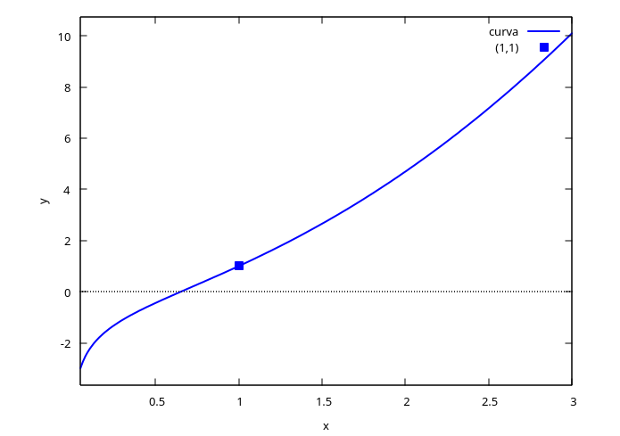

## Algo de historia

| Época | Autor(es) | Aporte |
|---|---|---|
| ~450 a.e.c. | Zenón | El movimiento es una ilusión |
| ~350 a.e.c. | Aristóteles | Teleología del movimiento: todo se mueve *por otro* — el primer motor inmóvil |
| S. XVII | Newton (*Principia*, 1687) | Quiere describir el movimiento, el cambio. Para eso inventa el cálculo y las ecuaciones diferenciales: **cómo cambian las cosas**, en lugar de dónde están o por qué cambian |
| S. XVIII | Bernoulli (Jacob, Johann, Daniel) | La braquistócrona, la catenaria y la ecuación de onda |
| S. XVIII | Euler y Lagrange | Reformulan toda la mecánica |
| S. XIX | Laplace | El determinismo |
| S. XIX | Fourier | La ecuación del calor (teoría de funciones) |
| S. XIX | Picard–Lindelöf | La imposibilidad de encontrar, en general, una solución exacta |
| S. XIX | Poincaré | El estudio cualitativo de las ecuaciones |
| S. XX | Lorenz y Smale | Aparecen los sistemas dinámicos y la teoría del caos |
| S. XX | — | Aplicaciones a biología (poblaciones, crecimiento celular), economía, neurociencia (Hodgkin–Huxley–Nagumo), epidemiología (modelo SIR), química (quimiotaxis), física cuántica, formación de estrellas y agujeros negros |

::: {.callout-important title="La idea central"}
El giro de Newton es el que define el curso: en lugar de preguntar **dónde** está algo o **por qué** cambia, una ecuación diferencial pregunta **cómo** cambia — y de ahí se reconstruye todo lo demás.
:::

## Ejercicios resueltos del Simmons

::: {.callout-tip title="Ejercicio 1-j — Verificar una solución implícita"}
Verificar que $x^2 = 2y^2\log y$ es solución de

$$y' = \frac{xy}{x^2+y^2}$$
:::

Derivamos implícitamente, pensando a $y$ como función de $x$:

$$2x = 4y\,y'\log y + 2y^2\cdot\frac{y'}{y} = 4y\,y'\log y + 2y\,y' = 2y\,y'\big(2\log y + 1\big)$$

$$\Rightarrow\quad x = y\,y'\big(2\log y + 1\big)$$

De la ecuación original, $\log y = \dfrac{x^2}{2y^2}$. Reemplazando:

$$x = y\,y'\left(\frac{x^2}{y^2}+1\right) = y\,y'\cdot\frac{x^2+y^2}{y^2} \quad\Longrightarrow\quad xy = y'(x^2+y^2)$$

$$\Longrightarrow\quad y' = \frac{xy}{x^2+y^2}\ \checkmark$$

::: {.callout-note title="Chequeo con Maxima"}
```maxima
kill(all);
depends(y, x);
eq: x^2 = 2*y^2*log(y);
deq: diff(eq, x);
solve(deq, diff(y,x));
```
:::

::: {.callout-tip title="Ejercicio 2-q — Solución general de una ecuación separable"}
Encuentre la solución general de

$$(1+x^2)\,dy + (1+y^2)\,dx = 0$$
:::

Se puede escribir como $(1+x^2)y' + (1+y^2) = 0$, de donde

$$y' = -\frac{1+y^2}{1+x^2} \quad\Longrightarrow\quad \frac{dy}{1+y^2} = -\frac{dx}{1+x^2}$$

Integrando ambos lados:

$$\arctan y = -\arctan x + C \quad\Longrightarrow\quad y = \tan\big(C - \arctan x\big)$$

Usando la identidad $\tan(A-B) = \dfrac{\tan A - \tan B}{1+\tan A\tan B}$ con $k=\tan C$:

$$y = \frac{k - x}{1 + kx}$$

::: {.callout-note title="Chequeo con Maxima"}
```maxima
kill(all);
ode: 'diff(y,x) = -(1+y^2)/(1+x^2);
sol: ode2(ode, y, x);
```
:::

::: {.callout-tip title="Ejercicio 3-f — Problema de valor inicial con fracciones parciales"}
Encuentre la solución particular de

$$(x+1)(x^2+1)\,y' = 2x^2+1, \qquad y(0)=1$$
:::

$$y' = \frac{2x^2+1}{(x+1)(x^2+1)}$$

Hacemos fracciones parciales: $\dfrac{2x^2+1}{(x+1)(x^2+1)} = \dfrac{A}{x+1} + \dfrac{Bx+C}{x^2+1}$

$$2x^2+1 = A(x^2+1) + (Bx+C)(x+1) = (A+B)x^2 + (B+C)x + (A+C)$$

Igualando coeficientes:

$$(1)\ A+B=2 \qquad (2)\ B+C=0 \qquad (3)\ A+C=1$$

De (2), $C=-B$. Sustituyendo en (3): $A-B=1$. Sumando con (1): $2A=3 \Rightarrow A=\tfrac32$, luego $B=\tfrac12$ y $C=-\tfrac12$.

$$y' = \frac{3/2}{x+1} + \frac{1}{2}\cdot\frac{x}{x^2+1} - \frac{1/2}{x^2+1}$$

::: {.callout-note title="Chequeo con Maxima"}
```maxima
kill(all);
ode: (x+1)*(x^2+1)*'diff(y,x) = 2*x^2+1;
sol: ode2(ode, y, x);
ic1(sol, x=0, y=1);
```
Como la ecuación es de **primer orden**, la condición inicial se fija con `ic1`, no con `ic2` (esa es para ecuaciones de segundo orden, que necesitan $y$ y $y'$ en el punto).
:::

Integrando:

$$y = \frac32\log|x+1| + \frac14\log(x^2+1) - \frac12\arctan x + K$$

Con la condición $y(0)=1$: $1 = 0+0-0+K \Rightarrow K=1$. Por tanto,

$$y = \frac32\log(x+1) + \frac14\log(x^2+1) - \frac12\arctan x + 1$$

::: {.callout-tip title="Ejercicio 4-b — Curva integral por un punto dado"}
Encuentre la curva integral que pasa por el punto $(1,1)$, sabiendo que

$$dy = \left(2x+\frac1x\right)dx$$
:::

Integrando directamente:

$$y = x^2 + \log x + C$$

Con la condición $y(1)=1$: $1 = 1^2+\log 1 + C \Rightarrow C=0$. La curva es

$$y = x^2 + \log x$$

::: {.callout-note title="Chequeo con Maxima"}
```maxima
kill(all);
ode: 'diff(y,x) = 2*x + 1/x;
sol: ode2(ode, y, x);
ic1(sol, x=1, y=1);
```
:::

::: {.callout-note title="Gráfica con Maxima"}
```maxima
kill(all);
y(x) := x^2 + log(x);

plot2d([y(x), [discrete, [[1,1]]]], [x, 0.05, 3],
       [style, [lines,2], [points,3,7]],
       [legend, "curva", "(1,1)"],
       [xlabel, "x"], [ylabel, "y"]);
```
:::



::: {.callout-important title="Tarea"}
Hacer los demás ejercicios de tarea, en especial el número 8.
:::
