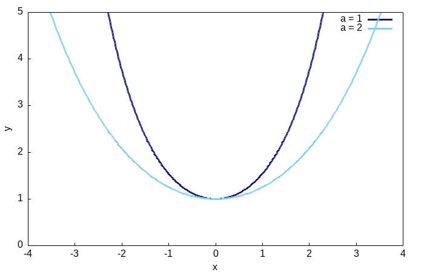
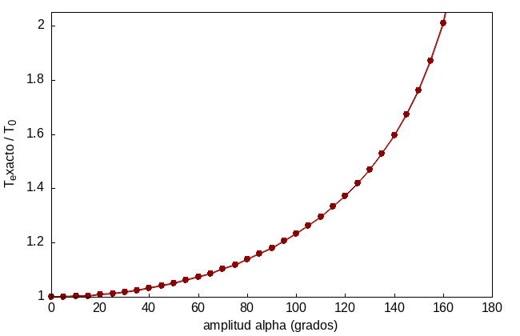
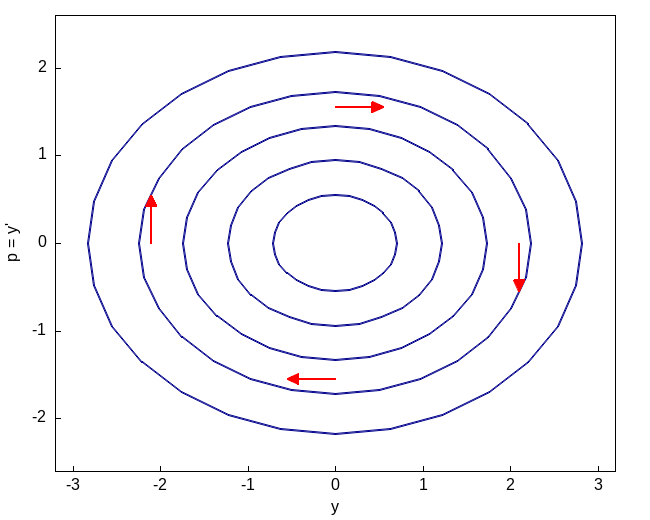

## Cuando el orden se puede bajar

La ecuación general de segundo orden es $F(x,y,y',y'')=0$, y en general no hay ningún método sistemático para resolverla (de hecho, la mayoría de las ecuaciones de segundo orden no lineales simplemente no se pueden resolver en términos de funciones elementales). Pero hay dos situaciones estructurales, sorprendentemente comunes en las aplicaciones, en las que la ecuación se puede bajar a dos ecuaciones de primer orden que se resuelven una tras otra. En ambos casos el truco es el mismo: introducir $p=y'$ como nueva variable dependiente; la pregunta es solo respecto a qué variable conviene derivar $p$.

### Falta la variable dependiente $y$

Si $y$ no aparece explícitamente en la ecuación, esta se puede escribir como

$$f(x,y',y'')=0$$

En ese caso, con $p=y'$ y $p'=y''$ (derivando respecto a $x$, como siempre), la ecuación se convierte en

$$f(x,p,p')=0$$

que ya es de primer orden en $p$. Si se puede resolver para $p(x)$, queda todavía una segunda integración, $y=\int p\,dx$, para recuperar $y$.

### Falta la variable independiente $x$

Si en cambio $x$ no aparece explícitamente, la ecuación tiene la forma

$$g(y,y',y'')=0$$

Aquí conviene, en cambio, tratar a $p$ como función de $y$ (no de $x$), usando la regla de la cadena:

$$y''=\frac{dp}{dx}=\frac{dp}{dy}\frac{dy}{dx}=p\frac{dp}{dy}$$

así que la ecuación se convierte en

$$g\!\left(y,p,p\frac{dp}{dy}\right)=0$$

que es de primer orden, ahora con $y$ haciendo las veces de variable independiente. Este segundo caso es exactamente lo que ocurre, físicamente, cuando se usa conservación de la energía en un sistema mecánico: la energía cinética depende de $p=v$ y la potencial de $y$, y derivar respecto a $y$ en vez de $x$ es, en el fondo, lo mismo que separar variables en la ecuación de energía.

Veamos tres aplicaciones clásicas: la primera usa el primer caso ($y$ ausente), y las otras dos, que resultan ser la misma ecuación disfrazada dos veces, usan el segundo ($x$ ausente).

## La catenaria: la forma de una cadena colgante

En 1690, Jakob Bernoulli planteó como reto público el problema de encontrar la curva que forma una cadena flexible colgada de sus dos extremos, bajo su propio peso (él mismo lo había intentado sin éxito). Al año siguiente, Leibniz, Huygens y Johann Bernoulli publicaron soluciones independientes. Fue Huygens quien le dio el nombre, del latín *catena*, cadena.

Supongamos que el eje $y$ pasa por el punto más bajo de la cadena, y sea $s$ la longitud de arco medida desde ese punto hasta un punto variable $(x,y)$. Si $w(s)$ es la densidad lineal de la cadena, el trozo de cadena entre el punto más bajo y $(x,y)$ está en equilibrio bajo tres fuerzas: la tensión horizontal $T_0$ en el punto más bajo, la tensión $T$ en $(x,y)$ (que actúa a lo largo de la tangente, porque la cadena es flexible), y el peso de ese trozo de cadena, dirigido hacia abajo. Igualando las componentes horizontal y vertical,

$$T\cos\theta=T_0,\qquad T\sin\theta=\int_0^s w(s)\,ds$$

donde $\theta$ es el ángulo que forma la tangente con la horizontal. Dividiendo estas dos ecuaciones,

$$\tan\theta=y'=\frac{1}{T_0}\int_0^s w(s)\,ds$$

Derivando esta última igualdad respecto a $x$, y usando que $ds/dx=\sqrt{1+(y')^2}$ (el elemento de arco),

$$T_0y''=w(s)\frac{ds}{dx}=w(s)\sqrt{1+(y')^2}$$

Para una cadena de densidad uniforme $w(s)=w_0$, y llamando $a=T_0/w_0$,

$$ay''=\sqrt{1+(y')^2}$$

Esta es una ecuación de segundo orden en la que $y$ no aparece explícitamente (solo $y'$ y $y''$): el primer caso de la sección anterior.

### Resolviendo por reducción de orden

Con $p=y'$, la ecuación se convierte en

$$ap'=\sqrt{1+p^2}$$

Aquí conviene resistir la tentación de elevar al cuadrado ambos lados para deshacerse de la raíz (eso complica innecesariamente el álgebra y puede introducir soluciones falsas al final). En cambio, separamos variables directamente,

$$\frac{dp}{\sqrt{1+p^2}}=\frac{dx}{a}$$

y usamos el hecho de que la derivada de $\operatorname{arcsenh}$ es exactamente el integrando de la izquierda ($\frac{d}{dp}\operatorname{arcsenh}(p)=1/\sqrt{1+p^2}$, lo cual se comprueba de inmediato derivando $\operatorname{senh}$): la antiderivada aparece de una vez, sin sustituciones adicionales, $\operatorname{arcsenh}(p)=\log\!\left(p+\sqrt{1+p^2}\right)$. Integrando ambos lados,

$$\operatorname{arcsenh}(p)=\frac{x}{a}+C_1$$

La pendiente en el punto más bajo es cero ($p=0$ cuando $x=0$, por construcción del eje $y$), así que $C_1=0$ y

$$p=y'=\operatorname{senh}\!\left(\frac{x}{a}\right)$$

Una segunda integración da, finalmente,

$$\boxed{y=a\cosh\!\left(\frac{x}{a}\right)+C_2}$$

que es la ecuación de la catenaria, con $C_2$ fijado por la altura del punto más bajo. El parámetro $a=T_0/w_0$ tiene una interpretación física directa: entre mayor la tensión horizontal $T_0$ frente al peso $w_0$, más abierta y plana es la curva cerca del origen; entre menor, más cerrada y puntiaguda.



::: {.callout-tip title="Una curiosidad que se prueba más adelante en el curso"}
Si esta curva se hace girar alrededor del eje $x$, la superficie de revolución que se genera tiene, entre todas las superficies que se apoyan en los mismos dos círculos extremos, el área mínima posible. Esto no es evidente a partir de lo que hemos visto aquí (se demuestra con cálculo de variaciones, minimizando directamente la integral del área), pero es una razón más para que esta curva, además de resolver un problema de equilibrio de fuerzas, también resuelva un problema de optimización geométrica.
:::

::: {.callout-note title="Haciendo las cuentas con Maxima"}
```maxima
kill(all);

/* Verificamos que y=a*cosh(x/a) resuelve a*y''=sqrt(1+(y')^2) */
y: a*cosh(x/a);
yp: diff(y,x);
ypp: diff(y,x,2);
chequeo: trigsimp(a*ypp - sqrt(1+yp^2));   /* debe dar 0 */
chequeo;

/* Confirmamos la antiderivada usada arriba */
integrate(1/sqrt(1+p^2), p);   /* da asinh(p), la forma log(p+sqrt(1+p^2)) */
```
:::

## El péndulo y el resorte: la misma ecuación dos veces

### El péndulo simple

Consideremos ahora un péndulo: una masa $m$ al final de una cuerda de longitud $a$ y peso despreciable, con $\theta$ el ángulo que forma con la vertical, y $\alpha$ el ángulo (la amplitud) desde el que se suelta el péndulo, partiendo del reposo. Suponiendo que no hay resistencia del aire, la energía se conserva: la energía cinética en el ángulo $\theta$ más la energía potencial en $\theta$ es igual a la energía potencial inicial en $\alpha$ (donde la energía cinética es cero, porque se suelta desde el reposo):

$$\frac12(a\dot\theta)^2+ga(1-\cos\theta)=ga(1-\cos\alpha)$$

(la velocidad a lo largo del arco es $a\dot\theta$, y la altura sobre el punto más bajo es $a(1-\cos\theta)$; ya dividimos entre la masa $m$). Despejando,

$$\dot\theta^2=\frac{2g}{a}(\cos\theta-\cos\alpha)$$

Este es exactamente el segundo caso de la sección anterior, aplicado directamente a la ecuación de movimiento. En efecto, la segunda ley de Newton a lo largo del arco da $a\ddot\theta=-g\sin\theta$, y si en esa ecuación (donde $x$, el tiempo, no aparece explícitamente) sustituimos $p=\dot\theta$ y $\ddot\theta=p\,dp/d\theta$,

$$ap\frac{dp}{d\theta}=-g\sin\theta\quad\Longrightarrow\quad ap\,dp=-g\sin\theta\,d\theta\quad\Longrightarrow\quad \frac{a}{2}p^2=g\cos\theta+C$$

y con la condición inicial $p=0$ en $\theta=\alpha$ se obtiene $C=-g\cos\alpha$: exactamente la misma ecuación de conservación de energía de arriba. Reducir el orden de una ecuación de movimiento y conservar la energía son, en el fondo, el mismo cálculo hecho dos veces.

**El periodo exacto.** Separando variables e integrando un cuarto de oscilación (de $\theta=0$ a $\theta=\alpha$), el periodo completo resulta

$$T=4\sqrt{\frac{a}{2g}}\int_0^\alpha \frac{d\theta}{\sqrt{\cos\theta-\cos\alpha}}$$

Con la identidad del ángulo mitad $\cos\theta=1-2\sin^2(\theta/2)$ y la sustitución $\sin(\theta/2)=k\sin\varphi$, con $k=\sin(\alpha/2)$ (de modo que $\varphi$ va de $0$ a $\pi/2$ cuando $\theta$ va de $0$ a $\alpha$), esta integral se transforma en

$$T=4\sqrt{\frac{a}{g}}\int_0^{\pi/2}\frac{d\varphi}{\sqrt{1-k^2\sin^2\varphi}}=4\sqrt{\frac{a}{g}}\,K(k)$$

donde $K(k)$ es la **integral elíptica completa de primera especie**. No existe forma de escribir $K(k)$ en términos de funciones elementales: hay que evaluarla numéricamente o con tablas.

::: {.callout-note title="Una curiosidad histórica: el error circular de los relojes de péndulo"}
Como $T$ depende de $\alpha$, un reloj de péndulo real se atrasa o adelanta según la amplitud con la que oscile; a este efecto se le llama, históricamente, el *error circular*. Christiaan Huygens, quien inventó el reloj de péndulo en 1656, descubrió que la única curva que hace que el periodo sea exactamente independiente de la amplitud (la propiedad *tautócrona*) no es el arco circular sino el cicloide, y llegó a construir relojes con mejillas cicloidales para forzar al péndulo a describir esa curva en vez de un arco de círculo. Es el mismo cicloide que resuelve el problema de la braquistócrona.
:::

**La aproximación de ángulo pequeño.** Cuando $\alpha$ es pequeño, $\sin\theta\approx\theta$ (coinciden hasta la primera cifra decimal para $\theta$ menor a unos $0.4$ radianes), y la ecuación $a\ddot\theta=-g\sin\theta$ se aproxima por

$$\ddot\theta+\frac{g}{a}\theta=0$$

que es la ecuación del oscilador armónico simple, con $\omega^2=g/a$. Su solución, sujeta a $\theta(0)=\alpha$ y $\dot\theta(0)=0$, es $\theta=\alpha\cos(\omega t)$, con periodo aproximado

$$T_0=2\pi\sqrt{\frac{a}{g}}$$

independiente de la amplitud $\alpha$: esta es la razón, después de todo, por la que decimos coloquialmente que el péndulo es isócrono, aunque estrictamente solo lo es en el límite de oscilaciones pequeñas.



::: {.callout-note title="Haciendo las cuentas con Maxima"}
```maxima
kill(all);

/* Comparamos el periodo exacto (integral eliptica, resuelta numericamente)
   contra la aproximacion de angulo pequeno, para a=1, g=9.8 */
periodo_exacto(alpha_grados) := block(
  [alpha: alpha_grados*%pi/180, integral],
  integral: quad_qags(1/sqrt(cos(theta)-cos(alpha)), theta, 0, alpha - 1e-9)[1],
  4*sqrt(1/(2*9.8))*integral
);
T0: 2*%pi*sqrt(1/9.8);

for alpha_grados in [5, 20, 45, 90, 150] do
  print("alpha=", alpha_grados, "grados:  T_exacto/T0 = ",
        float(periodo_exacto(alpha_grados)/T0));
/* la razon crece de aproximadamente 1.0005 (alpha=5) a 1.76 (alpha=150):
   el error circular es despreciable para oscilaciones pequenas, pero
   muy real para amplitudes grandes */
```
:::

### El resorte y la ley de Hooke

Consideremos ahora una masa $m$ atada a un resorte de constante $k$, sobre una superficie sin fricción, con $x$ la posición medida desde el equilibrio. La ley de Hooke dice que la fuerza restauradora es $F=-kx$ (el signo indica que se opone al desplazamiento). Por la segunda ley de Newton, $m\ddot x=-kx$, es decir

$$\ddot x+\frac{k}{m}x=0$$

Con $\omega^2=k/m$, esta es exactamente la misma ecuación que obtuvimos para el péndulo con ángulo pequeño. No es una coincidencia ni una simplificación forzada: los dos sistemas, uno gravitacional y otro elástico, comparten la misma estructura matemática porque en ambos la fuerza restauradora es, en la aproximación lineal, proporcional al desplazamiento y opuesta a él.

### Resolviendo $y''+\omega^2y=0$ por reducción de orden

Escribamos la ecuación en la variable genérica $y$ (que representa a $\theta$ en el péndulo o a $x$ en el resorte). Con $p=y'$ y $y''=p\,dp/dy$ (segundo caso, $x$ ausente),

$$p\frac{dp}{dy}+\omega^2y=0\quad\Longrightarrow\quad p\,dp=-\omega^2y\,dy\quad\Longrightarrow\quad p^2+\omega^2y^2=C$$

Esta constante $C$ es, salvo un factor, la energía total del sistema (cinética más potencial), conservada porque no hay fricción. Escribiendo $C=\omega^2A^2$, con $A$ la amplitud,

$$p=\frac{dy}{dx}=\pm\omega\sqrt{A^2-y^2}\quad\Longrightarrow\quad \frac{dy}{\sqrt{A^2-y^2}}=\pm\omega\,dx$$

Integrando, $\operatorname{arcsen}(y/A)=\pm\omega x+\varphi$, así que

$$\boxed{y=A\sin(\omega x+\varphi)}$$

La familia de curvas $p^2+\omega^2y^2=C$, para distintos valores de $C$, es una familia de elipses en el plano $(y,p)$: cada una corresponde a una amplitud de oscilación distinta, y el sistema recorre siempre la misma elipse, nunca salta de una a otra, porque no hay fricción que disipe o añada energía.



::: {.callout-note title="Haciendo las cuentas con Maxima"}
```maxima
kill(all);
depends(p,y);

/* Reduccion de orden, caso x ausente: y''+w^2*y=0 */
edo: p*'diff(p,y) + w^2*y = 0;
conservacion: ratsimp(integrate(p,p) + w^2*integrate(y,y));  /* (p^2+w^2*y^2)/2 = C */
conservacion;

/* Verificacion final: y=A*sin(w*x+phi) satisface y''+w^2*y=0 */
y_sol: A*sin(w*x+phi);
chequeo: ratsimp(diff(y_sol,x,2) + w^2*y_sol);   /* debe dar 0 */
chequeo;
```
:::

## Applet: dos sistemas, la misma ecuación

Para el péndulo, $\omega=\sqrt{g/a}$; para el resorte, $\omega=\sqrt{k/m}$. En ambos casos, soltando el sistema desde el reposo en su amplitud máxima, el movimiento es $y=A\cos(\omega t)$: la misma proyección de un punto que gira uniformemente sobre un círculo de radio $A$ con velocidad angular $\omega$. El siguiente simulador muestra esa conexión: el punto que gira sobre el círculo, a la izquierda, tiene en cada instante la misma altura que la curva trigonométrica que traza a la derecha; abajo se dibuja, en ese mismo instante, el sistema físico real que se haya seleccionado.

::: {.callout-note title="Simulador: el círculo de referencia, el péndulo y el resorte"}
```{=html}
<div style="border:1px solid #ddd;border-radius:8px;padding:16px;max-width:680px;margin:1em auto;font-family:sans-serif;">
  <div style="display:flex;gap:16px;align-items:center;margin-bottom:10px;flex-wrap:wrap;font-size:0.95em;">
    <strong>Sistema:</strong>
    <label><input type="radio" name="ro-modo" id="ro-modo-pendulo" checked> Péndulo</label>
    <label><input type="radio" name="ro-modo" id="ro-modo-resorte"> Resorte</label>
    <span style="margin-left:auto;color:#555;">Periodo actual: $T\approx$ <span id="ro-periodo">-</span> s</span>
  </div>

  <canvas id="ro-canvas-circulo" width="640" height="230" style="width:100%;height:auto;background:#fff;"></canvas>
  <canvas id="ro-canvas-fisico" width="640" height="190" style="width:100%;height:auto;background:#fff;margin-top:6px;"></canvas>

  <div id="ro-controles-pendulo" style="display:grid;grid-template-columns:1fr 1fr 1fr;gap:10px;margin-top:12px;">
    <label>$\alpha$ (ángulo inicial): <span id="ro-alpha-val">15</span>°
      <input type="range" id="ro-alpha" min="2" max="40" step="1" value="15" style="width:100%;">
    </label>
    <label>$a$ (longitud): <span id="ro-a-val">1.00</span> m
      <input type="range" id="ro-a" min="0.3" max="2" step="0.05" value="1" style="width:100%;">
    </label>
    <label>$g$ (gravedad): <span id="ro-g-val">9.80</span> m/s²
      <input type="range" id="ro-g" min="1.6" max="25" step="0.1" value="9.8" style="width:100%;">
    </label>
  </div>

  <div id="ro-controles-resorte" style="display:none;grid-template-columns:1fr 1fr 1fr;gap:10px;margin-top:12px;">
    <label>$k$ (constante del resorte): <span id="ro-k-val">10.0</span> N/m
      <input type="range" id="ro-k" min="1" max="40" step="0.5" value="10" style="width:100%;">
    </label>
    <label>$m$ (masa): <span id="ro-m-val">1.00</span> kg
      <input type="range" id="ro-m" min="0.2" max="5" step="0.1" value="1" style="width:100%;">
    </label>
    <label>$x_0$ (amplitud inicial): <span id="ro-x0-val">1.00</span>
      <input type="range" id="ro-x0" min="0.2" max="2" step="0.1" value="1" style="width:100%;">
    </label>
  </div>

  <p style="font-size:0.9em;color:#555;margin-top:10px;">
    Izquierda: un punto gira sobre un círculo de radio $A$ (la amplitud) con velocidad angular $\omega$; su altura sobre el centro es $A\cos(\omega t)$. Derecha: esa misma altura, graficada contra el tiempo, es la curva $y=A\cos(\omega t)$. Abajo: el sistema físico real, péndulo o resorte, en ese mismo instante. Al cambiar de sistema o mover un control, la animación reinicia desde la amplitud máxima, como si el sistema se soltara de nuevo desde el reposo. Nota: el dibujo del péndulo usa la aproximación de ángulo pequeño; para $\alpha$ grande el movimiento real ya no es exactamente sinusoidal, como se explica arriba con la integral elíptica.
  </p>
</div>
<script>
(function(){
  const canvasC = document.getElementById('ro-canvas-circulo');
  const ctxC = canvasC.getContext('2d');
  const canvasF = document.getElementById('ro-canvas-fisico');
  const ctxF = canvasF.getContext('2d');

  const modoPendulo = document.getElementById('ro-modo-pendulo');
  const modoResorte = document.getElementById('ro-modo-resorte');
  const ctrlPendulo = document.getElementById('ro-controles-pendulo');
  const ctrlResorte = document.getElementById('ro-controles-resorte');

  const alphaS = document.getElementById('ro-alpha');
  const aS = document.getElementById('ro-a');
  const gS = document.getElementById('ro-g');
  const kS = document.getElementById('ro-k');
  const mS = document.getElementById('ro-m');
  const x0S = document.getElementById('ro-x0');

  const alphaValEl = document.getElementById('ro-alpha-val');
  const aValEl = document.getElementById('ro-a-val');
  const gValEl = document.getElementById('ro-g-val');
  const kValEl = document.getElementById('ro-k-val');
  const mValEl = document.getElementById('ro-m-val');
  const x0ValEl = document.getElementById('ro-x0-val');
  const periodoEl = document.getElementById('ro-periodo');

  let t = 0;
  let lastTime = null;
  let historia = [];

  function actualizarModoUI(){
    if (modoPendulo.checked) {
      ctrlPendulo.style.display = 'grid';
      ctrlResorte.style.display = 'none';
    } else {
      ctrlPendulo.style.display = 'none';
      ctrlResorte.style.display = 'grid';
    }
    t = 0;
    historia = [];
  }

  modoPendulo.addEventListener('change', actualizarModoUI);
  modoResorte.addEventListener('change', actualizarModoUI);
  [alphaS, aS, gS, kS, mS, x0S].forEach((el) => {
    el.addEventListener('input', () => { t = 0; historia = []; });
  });

  function parametros(){
    if (modoPendulo.checked) {
      const alphaDeg = parseFloat(alphaS.value);
      const a = parseFloat(aS.value);
      const g = parseFloat(gS.value);
      alphaValEl.textContent = alphaDeg.toFixed(0);
      aValEl.textContent = a.toFixed(2);
      gValEl.textContent = g.toFixed(2);
      const omega = Math.sqrt(g / a);
      const alphaRad = alphaDeg * Math.PI / 180;
      return { omega: omega, amplitud: alphaRad, tipo: 'pendulo' };
    } else {
      const k = parseFloat(kS.value);
      const m = parseFloat(mS.value);
      const x0 = parseFloat(x0S.value);
      kValEl.textContent = k.toFixed(1);
      mValEl.textContent = m.toFixed(2);
      x0ValEl.textContent = x0.toFixed(2);
      const omega = Math.sqrt(k / m);
      return { omega: omega, amplitud: x0, tipo: 'resorte' };
    }
  }

  function dibujarCirculo(omega){
    const W = canvasC.width, H = canvasC.height;
    ctxC.clearRect(0, 0, W, H);

    const cx = 95, cy = H / 2, R = 68;
    ctxC.strokeStyle = '#999'; ctxC.lineWidth = 1;
    ctxC.beginPath(); ctxC.arc(cx, cy, R, 0, 2 * Math.PI); ctxC.stroke();
    ctxC.beginPath(); ctxC.moveTo(cx - R - 10, cy); ctxC.lineTo(cx + R + 10, cy); ctxC.stroke();
    ctxC.beginPath(); ctxC.moveTo(cx, cy - R - 10); ctxC.lineTo(cx, cy + R + 10); ctxC.stroke();

    const phi = omega * t;
    const px = cx + R * Math.sin(phi);
    const py = cy - R * Math.cos(phi);
    const y_norm = Math.cos(phi);

    const plotX0 = cx + R + 45;
    const plotW = W - plotX0 - 15;
    const T = 2 * Math.PI / omega;
    const ventana = 2 * T;

    ctxC.strokeStyle = '#999'; ctxC.lineWidth = 1;
    ctxC.beginPath(); ctxC.moveTo(plotX0, cy - R - 10); ctxC.lineTo(plotX0, cy + R + 10); ctxC.stroke();
    ctxC.beginPath(); ctxC.moveTo(plotX0, cy); ctxC.lineTo(plotX0 + plotW, cy); ctxC.stroke();

    historia.push({ tt: t, y: y_norm });
    while (historia.length && historia[0].tt < t - ventana) historia.shift();

    ctxC.strokeStyle = '#1f77b4'; ctxC.lineWidth = 2.2;
    ctxC.beginPath();
    historia.forEach((p, i) => {
      const px2 = plotX0 + ((p.tt - (t - ventana)) / ventana) * plotW;
      const py2 = cy - p.y * R;
      if (i === 0) ctxC.moveTo(px2, py2); else ctxC.lineTo(px2, py2);
    });
    ctxC.stroke();

    const puntaX = plotX0 + plotW;
    ctxC.setLineDash([4, 4]);
    ctxC.strokeStyle = '#aaa';
    ctxC.beginPath(); ctxC.moveTo(px, py); ctxC.lineTo(puntaX, py); ctxC.stroke();
    ctxC.setLineDash([]);

    ctxC.strokeStyle = '#d62728'; ctxC.lineWidth = 1.5;
    ctxC.beginPath(); ctxC.moveTo(cx, cy); ctxC.lineTo(px, py); ctxC.stroke();

    ctxC.fillStyle = '#d62728';
    ctxC.beginPath(); ctxC.arc(px, py, 5, 0, 2 * Math.PI); ctxC.fill();
    ctxC.beginPath(); ctxC.arc(puntaX, py, 5, 0, 2 * Math.PI); ctxC.fill();

    ctxC.fillStyle = '#333'; ctxC.font = '13px sans-serif';
    ctxC.fillText('y = A cos(ωt)', plotX0 + plotW / 2 - 48, cy - R - 14);
    ctxC.fillText('t', plotX0 + plotW - 8, cy + R + 24);

    if (periodoEl) periodoEl.textContent = T.toFixed(2);
  }

  function dibujarFisico(omega, amplitud, tipo){
    const W = canvasF.width, H = canvasF.height;
    ctxF.clearRect(0, 0, W, H);
    const cx = W / 2;

    function techo(x0, y0){
      ctxF.strokeStyle = '#333'; ctxF.lineWidth = 2;
      ctxF.beginPath(); ctxF.moveTo(x0 - 45, y0); ctxF.lineTo(x0 + 45, y0); ctxF.stroke();
      for (let i = -40; i <= 40; i += 10) {
        ctxF.beginPath(); ctxF.moveTo(x0 + i, y0); ctxF.lineTo(x0 + i - 8, y0 - 10); ctxF.stroke();
      }
    }

    if (tipo === 'pendulo') {
      const theta = amplitud * Math.cos(omega * t);
      const pivotX = cx, pivotY = 18;
      const L = 140;
      const bobX = pivotX + L * Math.sin(theta);
      const bobY = pivotY + L * Math.cos(theta);

      techo(pivotX, pivotY);
      ctxF.setLineDash([4, 4]); ctxF.strokeStyle = '#ccc';
      ctxF.beginPath(); ctxF.moveTo(pivotX, pivotY); ctxF.lineTo(pivotX, pivotY + L); ctxF.stroke();
      ctxF.setLineDash([]);

      ctxF.strokeStyle = '#555'; ctxF.lineWidth = 2;
      ctxF.beginPath(); ctxF.moveTo(pivotX, pivotY); ctxF.lineTo(bobX, bobY); ctxF.stroke();

      ctxF.fillStyle = '#333'; ctxF.beginPath(); ctxF.arc(pivotX, pivotY, 3, 0, 2 * Math.PI); ctxF.fill();
      ctxF.fillStyle = '#d62728'; ctxF.beginPath(); ctxF.arc(bobX, bobY, 13, 0, 2 * Math.PI); ctxF.fill();

      ctxF.fillStyle = '#333'; ctxF.font = '13px sans-serif';
      ctxF.fillText('θ(t) = α·cos(ωt)', 10, H - 12);
    } else {
      const x = amplitud * Math.cos(omega * t);
      const anchorX = cx, anchorY = 15;
      const L0 = 55;
      const escala = 35;
      const Lact = Math.max(20, L0 + x * escala);
      const massY = anchorY + Lact;

      techo(anchorX, anchorY);
      ctxF.setLineDash([4, 4]); ctxF.strokeStyle = '#ccc';
      ctxF.beginPath(); ctxF.moveTo(anchorX - 55, anchorY + L0); ctxF.lineTo(anchorX + 55, anchorY + L0); ctxF.stroke();
      ctxF.setLineDash([]);

      const nseg = 10;
      ctxF.strokeStyle = '#555'; ctxF.lineWidth = 2;
      ctxF.beginPath();
      ctxF.moveTo(anchorX, anchorY);
      for (let i = 1; i < nseg; i++) {
        const yy = anchorY + (Lact * i) / nseg;
        const xx = anchorX + (i % 2 === 0 ? 0 : (i % 4 === 1 ? 18 : -18));
        ctxF.lineTo(xx, yy);
      }
      ctxF.lineTo(anchorX, massY);
      ctxF.stroke();

      ctxF.fillStyle = '#d62728';
      ctxF.fillRect(anchorX - 22, massY, 44, 32);

      ctxF.fillStyle = '#333'; ctxF.font = '13px sans-serif';
      ctxF.fillText('x(t) = x₀·cos(ωt)', 10, H - 12);
    }
  }

  function loop(timestamp){
    if (lastTime === null) lastTime = timestamp;
    const dt = Math.min((timestamp - lastTime) / 1000, 0.05);
    lastTime = timestamp;
    t += dt;

    const p = parametros();
    dibujarCirculo(p.omega);
    dibujarFisico(p.omega, p.amplitud, p.tipo);

    requestAnimationFrame(loop);
  }

  actualizarModoUI();
  requestAnimationFrame(loop);
})();
</script>
```
:::

::: {.callout-important title="Tarea"}
Haga los ejercicios de la sección 11 (Reducción de Orden, problemas 1 y 3, páginas 85 a 88) y de la sección 12 (La Cadena Colgante, problemas 1 y 3, páginas 88 a 95) del Simmons, comprobando cada resultado con Maxima. Note que el problema 3 de la sección 12 es precisamente el caso de un puente colgante (un cable de peso despreciable que soporta una carga horizontal constante, en vez de su propio peso): compare la forma que obtiene con la catenaria de esta sección y explique, en un par de líneas, por qué son curvas distintas.
:::
