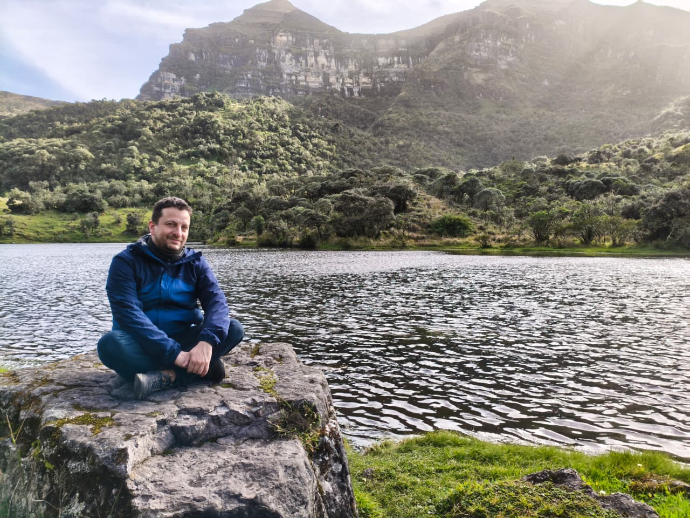

Soy profesor titular en la Universidad Distrital Francisco José de Caldas y hago parte de los grupos de investigación MESCUD y CMyT. Realicé mis estudios de pregrado, maestría y doctorado en Matemáticas en la Universidad Nacional de Colombia, bajo la dirección de los profesores Alfonso Castro (Harvey Mudd College) y Francisco Caicedo (Universidad Nacional de Colombia). Anteriormente, fui docente de planta en la Universidad de los Andes en Bogotá.

Mi investigación se centra en ecuaciones diferenciales parciales y funcional-diferenciales mediante métodos topológicos, con especial énfasis en la ecuación de onda semilineal con condiciones de Dirichlet-periódicas.

Correo: [aasanjuanc@udistrital.edu.co](mailto:aasanjuanc@udistrital.edu.co)