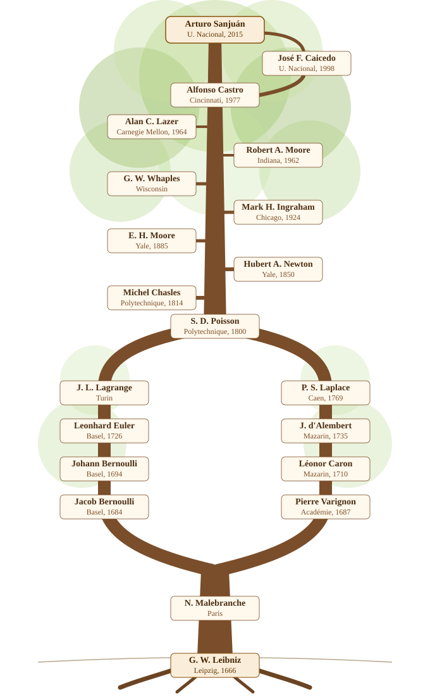

Mathematicians keep an unusual kind of record: not who taught them a subject, but who supervised their doctoral thesis, and who supervised that person's, and so on. The [Mathematics Genealogy Project](https://www.mathgenealogy.org/) has been collecting these advisor-student links since 1997. My own entry is [id 191294](https://www.mathgenealogy.org/id.php?id=191294).

My dissertation, *Membranas Vibrantes* (Universidad Nacional de Colombia, 2015), was co-advised by [Alfonso Castro](https://www.mathgenealogy.org/id.php?id=9869) and [José Francisco Caicedo](https://www.mathgenealogy.org/id.php?id=86396). Caicedo himself was a student of Castro, so the line briefly closes on itself before continuing upward.

From there the tree splits into two branches that meet again at Siméon Denis Poisson: one through Alan Lazer, Robert Alonzo Moore, George Whaples, Mark Ingraham and E. H. Moore up to Hubert Anson Newton; the other through d'Alembert, Léonor Caron and Pierre Varignon up to Malebranche and, by attribution rather than formal supervision, Leibniz.

It's a fitting ancestry for my own field. The wave equation I work on today has its roots in exactly this branch: in 1727, Johann Bernoulli modeled a vibrating string as a finite chain of discrete masses connected by springs, deriving a difference equation for each mass's displacement. Two decades later, d'Alembert took that discrete model to its continuous limit, arriving at the wave equation itself and solving it in the same stroke — only for Daniel Bernoulli to propose a rival solution in trigonometric series, sparking a three-way, decades-long dispute with d'Alembert and Euler over which one was actually general. Lagrange revisited the problem in 1759 and came close to a resolution without quite reaching one; it would take Fourier, half a century later, to show both solutions were really the same thing, forcing mathematicians to rethink what a "function" was allowed to be in the first place.

{fig-alt="A tree diagram showing the mathematical genealogy from Leibniz down to Arturo Sanjuán, with two branches that split and rejoin at Poisson."}

## The chain

| Mathematician | Institution | Year |
|---|---|---|
| Arturo Sanjuán | Universidad Nacional de Colombia | 2015 |
| José Francisco Caicedo | Universidad Nacional de Colombia | 1998 |
| Alfonso Castro | University of Cincinnati | 1977 |
| Alan C. Lazer | Carnegie Mellon University | 1964 |
| Robert Alonzo Moore | Indiana University | 1962 |
| George W. Whaples | University of Wisconsin | — |
| Mark Hoyt Ingraham | University of Chicago | 1924 |
| E. H. Moore | Yale University | 1885 |
| Hubert Anson Newton | Yale University | 1850 |
| Michel Chasles | École Polytechnique | 1814 |
| Siméon Denis Poisson | École Polytechnique | 1800 |
| Joseph-Louis Lagrange / Pierre-Simon Laplace | — | — |
| *(Lagrange branch)* Leonhard Euler | University of Basel | 1726 |
| *(Lagrange branch)* Johann Bernoulli | University of Basel | 1694 |
| *(Lagrange branch)* Jacob Bernoulli | University of Basel | 1684 |
| *(Laplace branch)* Jean le Rond d'Alembert | Collège Mazarin | 1735 |
| *(Laplace branch)* Léonor Caron | Collège Mazarin | 1710 |
| *(Laplace branch)* Pierre Varignon | Académie royale des sciences | 1687 |
| Nicolas Malebranche | — | — |
| Gottfried Wilhelm Leibniz | Leipzig | 1666 |

A couple of caveats worth stating plainly. Advisor-student links before roughly 1800 rarely mean a doctoral supervision in the modern sense; several of these are informal mentorships or attributions the project itself flags as uncertain (this is explicitly the case for Malebranche and Leibniz, and for Lagrange as advisor to Poisson). I've kept the chain as the Mathematics Genealogy Project records it, rather than editing it toward what a stricter modern reading might prefer.

As for my own branch I've directed undergraduate and master's students, but nothing yet at the doctoral level that the Mathematics Genealogy Project would register, so for now the tree only grows upward from here.